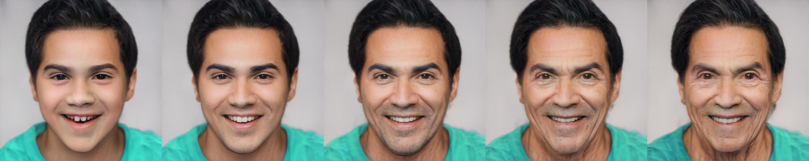
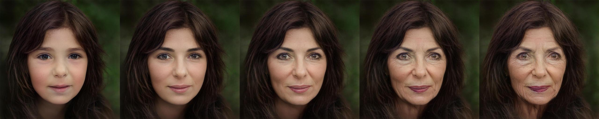

# Only a Matter of Style: Age Transformation Using a Style-Based Regression Model (SIGGRAPH 2021)

> The  task of age transformation illustrates the change of an individual's appearance over time. Accurately modeling this complex transformation over an input facial image is extremely challenging as it requires making convincing and possibly large changes to facial features and head shape, while still preserving the input identity. In this work, we present an image-to-image translation method that learns to directly encode real facial images into the latent space of a pre-trained unconditional GAN (e.g., StyleGAN) subject to a given aging shift. We employ a pre-trained age regression network used to explicitly guide the encoder to generate the latent codes corresponding to the desired age. In this formulation, our method approaches the continuous aging process as a regression task between the input age and desired target age, providing fine-grained control on the generated image. Moreover, unlike other approaches that operate solely in the latent space using a prior on the path controlling age, our method learns a more disentangled, non-linear path. We demonstrate that the end-to-end nature of our approach, coupled with the rich semantic latent space of StyleGAN, allows for further editing of the generated images. Qualitative and quantitative evaluations show the advantages of our method compared to state-of-the-art approaches.

Inference Notebook: &nbsp;  
Animation Notebook: 

## Description   
Official Implementation of our Style-based Age Manipulation (SAM) paper for both training and evaluation. SAM 
allows modeling fine-grained age transformation using a single input facial image

